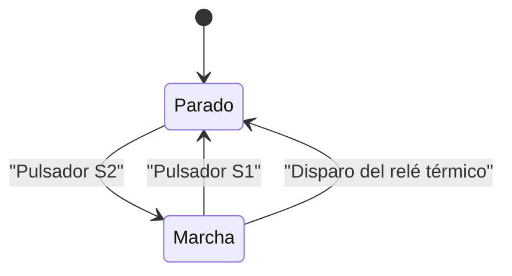
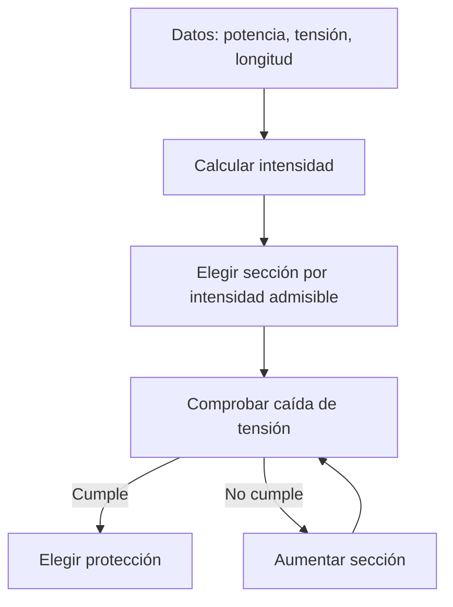
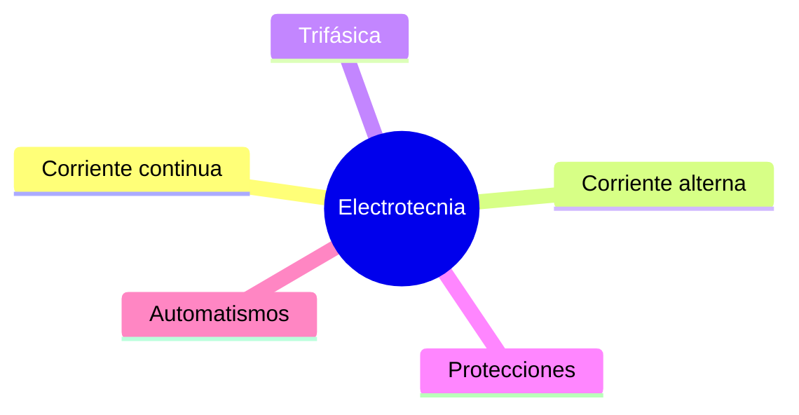

# Ejemplos Mermaid

## Bloques de una instalación de vivienda

```mermaid
flowchart LR
    A["Acometida"] --> B["Caja general de protección"]
    B --> C["Línea general de alimentación"]
    C --> D["Contador"]
    D --> E["Derivación individual"]
    E --> F["Cuadro general de mando y protección"]
    F --> G["Circuitos interiores"]
```

## Arranque directo de un motor (estados)

```mermaid
stateDiagram-v2
    [*] --> Parado
    Parado --> Marcha: "Pulsador S2"
    Marcha --> Parado: "Pulsador S1"
    Marcha --> Parado: "Disparo del relé térmico"
```

## Procedimiento de cálculo de una línea

```mermaid
flowchart TD
    A["Datos: potencia, tensión, longitud"] --> B["Calcular intensidad"]
    B --> C["Elegir sección por intensidad admisible"]
    C --> D["Comprobar caída de tensión"]
    D -->|"Cumple"| E["Elegir protección"]
    D -->|"No cumple"| F["Aumentar sección"]
    F --> D
```

## Mapa de temario

```mermaid
mindmap
  root((Electrotecnia))
    Corriente continua
    Corriente alterna
    Trifásica
    Protecciones
    Automatismos
```
